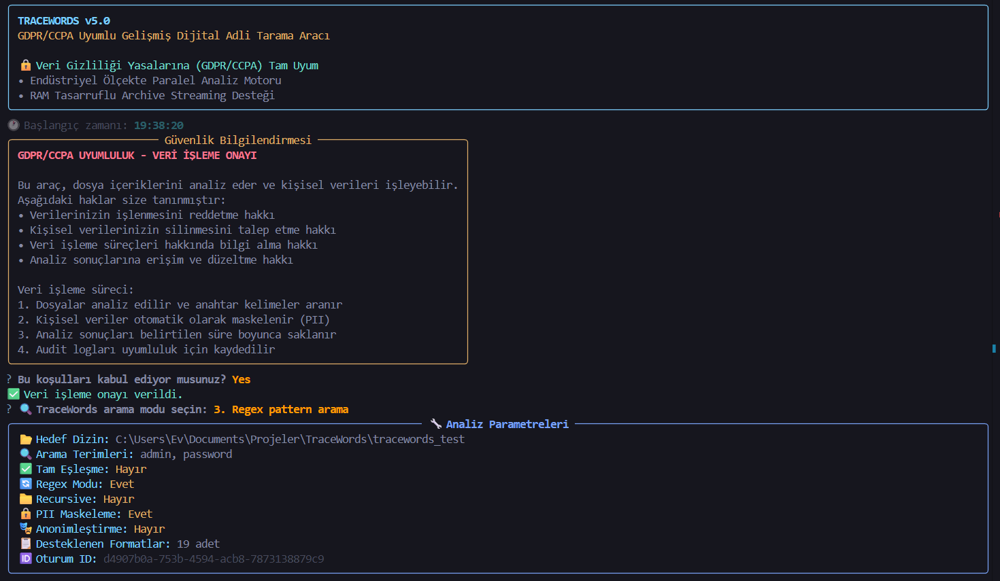
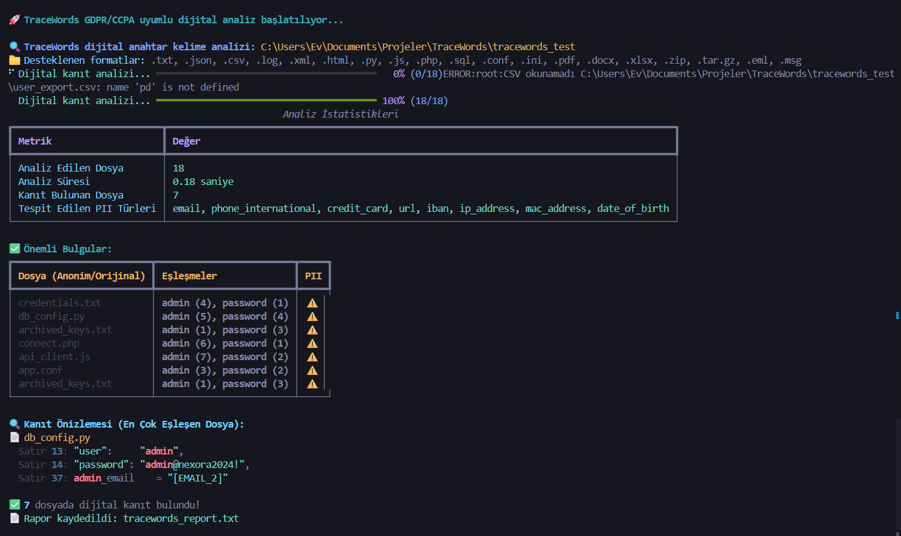

# 🕵️‍♂️ TraceWords - GDPR/CCPA Uyumlu Dijital Anahtar Kelime Adli Taraması Aracı

[](https://github.com/ibrahimyigitcetin/TraceWords)
[](https://github.com/ibrahimyigitcetin/TraceWords)
[](https://github.com/ibrahimyigitcetin/TraceWords)
[](https://github.com/ibrahimyigitcetin/TraceWords)
[](https://github.com/ibrahimyigitcetin/TraceWords)
[](https://github.com/ibrahimyigitcetin/TraceWords)

🔍 **GDPR/CCPA Uyumlu Dijital Anahtar Kelime Adli Taraması v5.0**

TraceWords, veri gizliliği yasalarına uyumlu olarak tasarlanmış, dijital adli bilişim standartlarında anahtar kelime arama ve dijital kanıt toplama aracıdır. Güvenlik uzmanları, sistem yöneticileri ve dijital adli bilişim uzmanları için geliştirilmiştir.





---

## 🎯 Özellikler

### 🔒 Veri Gizliliği ve Yasal Uyumluluk

| Özellik | Açıklama |
|---|---|
| **GDPR Uyumluluğu** | Avrupa Birliği Genel Veri Koruma Tüzüğü |
| **CCPA Uyumluluğu** | California Tüketici Gizliliği Yasası |
| **PII Otomatik Tespiti** | 12 farklı kişisel veri türü tanıma |
| **Veri Maskeleme** | Hassas bilgilerin otomatik maskelenmesi |
| **Kullanıcı Onay Sistemi** | Veri işleme için açık rıza |
| **Veri Saklama Yönetimi** | Otomatik veri temizleme (90 gün) |
| **Audit Loglama** | Tüm işlemlerin denetim kaydı |

### 📂 Desteklenen Dosya Formatları

| Kategori | Uzantılar |
|---|---|
| **Metin dosyaları** | `.txt`, `.log`, `.conf`, `.ini` |
| **Kod dosyaları** | `.py`, `.js`, `.php`, `.sql` |
| **Markup dosyaları** | `.html`, `.xml` |
| **Veri dosyaları** | `.json`, `.csv` |
| **Ofis dosyaları** | `.pdf`, `.docx`, `.xlsx` |
| **E-posta dosyaları** | `.eml`, `.msg` |
| **Arşiv dosyaları** | `.zip`, `.tar.gz` |

### 🔍 Arama Modları

| Mod | Açıklama |
|---|---|
| **Kısmi Eşleşme** | Kelime parçalarını da bulur |
| **Tam Kelime Eşleşmesi** | Sadece tam kelime eşleşmelerini bulur |
| **Regex Pattern Arama** | Gelişmiş pattern arama desteği |

### 🛡️ Dijital Adli Bilişim Özellikleri

| Özellik | Açıklama |
|---|---|
| **SHA-256 Hash Hesaplama** | Dosya bütünlüğü kontrolü (v5.0'da MD5'ten yükseltildi) |
| **Metadata Toplama** | Dosya oluşturma/değiştirme tarihleri |
| **Bağlam Çıkarma** | Bulunan kelimelerin etrafındaki içerik (PII maskelenmiş) |
| **Paralel İşleme** | Hızlı analiz için çoklu thread desteği |
| **Üçlü Loglama** | Ana, audit ve privacy logları (dönen log desteğiyle) |
| **Oturum Takibi** | Her analiz için benzersiz session ID |

### 🔐 PII Tespit Edilen Veri Türleri

| Veri Türü | Açıklama |
|---|---|
| **E-posta Adresi** | Standart e-posta formatı |
| **Telefon Numarası** | ABD ve uluslararası formatlar |
| **SSN** | ABD Sosyal Güvenlik Numarası |
| **Kredi Kartı** | Visa, Mastercard, Amex ve diğerleri |
| **IP Adresi** | Gelişmiş oktet doğrulaması ile |
| **MAC Adresi** | Ağ arayüz tanımlayıcısı |
| **T.C. Kimlik No** | Matematiksel algoritma doğrulamalı |
| **IBAN** | Uluslararası banka hesap numarası |
| **Pasaport No** | Uluslararası pasaport formatı |
| **Doğum Tarihi** | GG/AA/YYYY ve varyantları |
| **URL** | HTTP/HTTPS bağlantıları |

### 🆕 v5.0 ile Gelen Yeni Özellikler

| Özellik | Açıklama | Parametre |
|---|---|---|
| **Fernet Şifreleme** | Raporları ve log dosyalarını şifreli saklama | `--encrypt`, `--encrypt-logs` |
| **Arşiv Desteği (Streaming)** | `.zip` ve `.tar.gz` içindeki dosyaları RAM'e almadan tarama | — |
| **Zip/Tar Bomb Koruması** | Sıkıştırma oranı kontrolü ile saldırı engelleme | — |
| **Güvenli Silme** | Kaynak dosyaları çoklu geçişle üzerine yazarak silme | `--wipe-source` |
| **Batch Modu** | Etkileşimli soruları atlayan otomasyon desteği | `--batch` |
| **Self-Test** | Yerleşik güvenlik ve doğrulama test sistemi | `--self-test` |
| **ReDoS Koruması** | Regex işlemleri zaman aşımıyla güvenceye alındı | — |
| **Büyük Dosya Optimizasyonu** | 10MB üzerindeki dosyalar satır satır, bellek dostu işlenir | — |
| **Path Traversal Koruması** | Dizin geçişi saldırılarına karşı güvenli path doğrulaması | — |

---

## 📋 Gereksinimler

```bash
pip install -r requirements.txt
```

### Python Modülleri

- `pandas`: CSV dosya işleme
- `tqdm`: İlerleme çubuğu
- `rich`: Renkli terminal arayüzü
- `questionary`: Etkileşimli CLI menüleri
- `cryptography`: Fernet şifreleme
- `pypdf`: PDF okuma
- `python-docx`: DOCX okuma
- `openpyxl`: XLSX okuma
- `extract-msg`: MSG e-posta okuma
- `concurrent.futures`: Paralel işleme
- `hashlib`: Hash hesaplama
- `logging`: Loglama
- `uuid`: Oturum ID oluşturma
- `re`: Regex işlemleri

---

## 🚀 Kurulum

1. Repository'yi klonlayın:

```bash
git clone https://github.com/ibrahimyigitcetin/TraceWords.git
cd TraceWords
```

2. Gerekli kütüphaneleri yükleyin:

```bash
pip install -r requirements.txt
```

3. TraceWords'ü çalıştırın:

```bash
python tracewords.py /path/to/directory -k "anahtar,kelime"
```

### Virtual Environment ile Kurulum (Önerilen)

**Windows:**

```bash
python -m venv tracewords_env
tracewords_env\Scripts\activate
pip install -r requirements.txt
python tracewords.py path\to\directory -k "password,admin,hack"
deactivate
```

**Linux/macOS:**

```bash
python3 -m venv tracewords_env
source tracewords_env/bin/activate
pip install -r requirements.txt
python tracewords.py /path/to/directory -k "password,admin,hack"
deactivate
```

---

## 💻 Kullanım

### Temel Kullanım

```bash
python tracewords.py /path/to/directory -k "password,admin,hack"
```

### Komut Satırı Parametreleri

| Parametre | Kısaltma | Açıklama | Varsayılan |
|---|---|---|---|
| `directory` | - | Analiz edilecek dizin yolu | Zorunlu |
| `--keywords` | `-k` | Virgülle ayrılmış arama terimleri | Opsiyonel |
| `--exact` | `-e` | Tam kelime eşleşmesi | False |
| `--regex` | `-r` | Regex pattern arama modu | False |
| `--recursive` | - | Alt dizinleri de analiz et | False |
| `--output` | `-o` | Rapor dosya adı | tracewords_report.txt |
| `--no-pii-mask` | - | PII maskelemeyi devre dışı bırak | False |
| `--anonymize` | - | Dosya isimlerini anonimleştir | False |
| `--cleanup` | - | Eski verileri temizle (GDPR uyumluluk) | False |
| `--encrypt` | - | Raporu Fernet ile şifreli kaydet | False |
| `--encrypt-logs` | - | Log dosyalarını şifreli sakla | False |
| `--wipe-source` | - | Taranan kaynak dosyaları güvenli sil ⚠️ | False |
| `--batch` | `-b` | Otomasyon modu (etkileşim yok) | False |
| `--self-test` | - | Güvenlik ve doğrulama testlerini çalıştır | False |

> ⚠️ `--exact` ve `--regex` aynı anda kullanılamaz (birbirini dışlayan gruplar).

### Örnek Kullanımlar

#### 1. Basit GDPR Uyumlu Arama

```bash
python tracewords.py /var/log -k "error,warning,critical"
```

#### 2. PII Maskeleme ile Tam Kelime Eşleşmesi

```bash
python tracewords.py /home/user/documents -k "password,admin" -e
```

#### 3. Regex Pattern ile Kredi Kartı Tespiti

```bash
python tracewords.py /payment/data -k "\b(?:4[0-9]{12}(?:[0-9]{3})?|5[1-5][0-9]{14})\b" -r
```

#### 4. Anonimleştirilmiş Recursive Arama

```bash
python tracewords.py /home/user -k "confidential,secret" --recursive --anonymize
```

#### 5. Şifreli Rapor ile Analiz

```bash
python tracewords.py /logs -k "attack,intrusion" --encrypt -o security_report.txt
```

#### 6. Otomasyon (Batch) Modu

```bash
python tracewords.py /data -k "token,apikey" --batch --recursive -o output.txt
```

#### 7. Log Dosyalarını Şifrele ve Kaynakları Güvenli Sil

```bash
python tracewords.py /sensitive -k "secret" --encrypt-logs --wipe-source
```

#### 8. Self-Test Çalıştır

```bash
python tracewords.py . --self-test
```

#### 9. GDPR Uyumlu Veri Temizliği

```bash
python tracewords.py --cleanup
```

---

## 📊 GDPR/CCPA Uyumlu Rapor Formatı

TraceWords, veri gizliliği yasalarına uygun detaylı rapor oluşturur:

```
================================================================================
TRACEWORDS — GDPR/CCPA UYUMLU DİJİTAL ADLİ TARAMA RAPORU
================================================================================
TraceWords v5.0 - GDPR/CCPA Uyumlu Dijital Adli Tarama Aracı
Analiz Tarihi: 2024-01-15 14:30:25
Oturum ID: 550e8400-e29b-41d4-a716-446655440000
Aranan Terimler: password, admin, hack
Bulunan Dijital Kanıt Dosyası: 3
Analiz Edilen Dizin: /var/log

VERİ GİZLİLİĞİ VE UYUMLULUK BİLGİLERİ
--------------------------------------------------
PII Maskeleme Durumu: Aktif
Veri Minimizasyonu: Aktif
Audit Loglama: Aktif
Sonuç Anonimleştirme: Pasif
Veri Saklama Süresi: 90 gün
Silinme Tarihi: 2024-04-15

KİŞİSEL VERİ (PII) TESPİT ÖZETİ
----------------------------------------
  🔒 E-posta Adresi: 5 adet
  🔒 Telefon No: 3 adet
  🔒 IP Adresi: 12 adet

⚠️  Tüm kişisel veriler maskelenmiştir ve orijinal değerler rapordan çıkarılmıştır.

----------------------------------------------------------------------
DİJİTAL KANIT DOSYASI: file_a1b2c3d4.log
----------------------------------------------------------------------
Dosya Boyutu: 2,048 bytes
Son Değiştirilme: 2024-01-15 12:15:30
Oluşturulma Tarihi: 2024-01-14 09:00:00
SHA-256 Hash (Adli Bütünlük): a1b2c3d4e5f6...
Tespit Edilen PII Türleri: email, ip_address
PII Maskeleme Uygulandı: Evet

BULUNAN DİJİTAL KANITLAR:
  🔍 password: 5 eşleşme
  🔍 admin: 2 eşleşme

KANIT BAĞLAMLARI (PII MASKELENMİŞ):
  [1] Satır 42:
      Eşleşen: Failed password attempt for user admin
  Bağlam:
      Jan 15 12:15:30 server sshd[1234]: Invalid user test from [IP_ADDR_0]
      Jan 15 12:15:30 server sshd[1234]: Failed password attempt for user admin
      Jan 15 12:15:31 server sshd[1234]: Connection closed by [IP_ADDR_0]
```

---

## 🔧 Yapılandırma

### GDPR/CCPA Uyumluluk Ayarları

```python
PRIVACY_SETTINGS = {
    "enable_pii_masking": True,           # PII maskeleme
    "enable_data_minimization": True,     # Veri minimizasyonu
    "enable_audit_logging": True,         # Audit loglama
    "retention_period_days": 90,          # Veri saklama süresi
    "anonymize_results": False,           # Sonuç anonimleştirme
    "require_consent": True,              # Kullanıcı onayı
    "enable_right_to_be_forgotten": True  # Unutulma hakkı
}
```

### Sabitler (Config)

```python
MAX_FILE_SIZE_MB = 100          # Maksimum dosya boyutu
MAX_TOTAL_EXTRACT_SIZE_MB = 500 # Arşiv toplam çıkarma limiti
MAX_ARCHIVE_DEPTH = 3           # İç içe arşiv derinliği
MAX_ARCHIVE_FILES = 1000        # Arşiv içi maksimum dosya sayısı
REGEX_TIMEOUT_SEC = 2           # ReDoS koruma zaman aşımı
HASH_ALGORITHM = "sha256"       # Hash algoritması
SECURE_DELETE_PASSES = 3        # Güvenli silme geçiş sayısı
ZIP_BOMB_RATIO_LIMIT = 100      # Zip bomb tespit oranı
LARGE_FILE_THRESHOLD_BYTES = 10MB # Chunked işleme eşiği
LOG_FILE = "tracewords_info.log"
AUDIT_LOG_FILE = "tracewords_audit.log"
PRIVACY_LOG_FILE = "tracewords_privacy.log"
```

### Şifreleme Anahtarı Yönetimi

TraceWords, şifreleme anahtarını şu sırayla arar:

1. `TRACEWORDS_ENCRYPTION_KEY` ortam değişkeni
2. `~/.tracewords/keyfile` dosyası
3. Yukarıdakiler yoksa otomatik üretir ve keyfile'a kaydeder

### Üçlü Loglama Sistemi

TraceWords üç farklı dönen log dosyası oluşturur (her biri maks. 50MB, 5 yedek):

1. **tracewords_info.log**: Ana sistem logları
2. **tracewords_audit.log**: Denetim kayıtları
3. **tracewords_privacy.log**: Veri gizliliği olayları

---

## 🚨 Güvenlik ve Yasal Notlar

### Veri Gizliliği

1. **GDPR Uyumluluk**: AB vatandaşlarının verilerini işlerken GDPR gerekliliklerine uyun
2. **CCPA Uyumluluk**: California sakinlerinin verilerini işlerken CCPA gerekliliklerine uyun
3. **PII Koruma**: Kişisel tanımlayıcı bilgileri her zaman maskeleyin
4. **Veri Minimizasyonu**: Sadece gerekli verileri işleyin

### Güvenlik

1. **Yetkilendirme**: Sadece yetkiniz olan dosyaları analiz edin
2. **Gizlilik**: Hassas bilgileri içeren raporları güvenli yerlerde saklayın
3. **Yasal Uyumluluk**: Yerel yasalara uygun olarak kullanın
4. **Veri Bütünlüğü**: SHA-256 hash değerlerini doğrulayın
5. **Arşiv Güvenliği**: Zip bomb ve tar bomb koruması varsayılan olarak etkindir

### Veri Sahibi Hakları

- **Erişim Hakkı**: Veri sahipleri işlenen verilerine erişim talep edebilir (GDPR Madde 15, CCPA §1798.110)
- **Düzeltme Hakkı**: Yanlış verilerin düzeltilmesini talep edebilir (GDPR Madde 16)
- **Silme Hakkı**: Verilerinin silinmesini talep edebilir (GDPR Madde 17, CCPA §1798.105)
- **Taşınabilirlik Hakkı**: Verilerini başka bir sisteme aktarabilir (GDPR Madde 20)
- **İtiraz Hakkı**: Veri işlemeye itiraz edebilir (GDPR Madde 21, CCPA §1798.120)

---

## 📝 Sürüm Notları

### v5.0

- Fernet simetrik şifreleme (rapor ve log şifreleme)
- `.zip` ve `.tar.gz` arşiv desteği (streaming, RAM dostu)
- Zip bomb / tar bomb tespiti ve engelleme
- Güvenli dosya silme (`--wipe-source`, 3 geçişli üzerine yazma)
- Batch/otomasyon modu (`--batch`)
- Yerleşik self-test sistemi (`--self-test`)
- ReDoS koruması (regex zaman aşımı, thread pool)
- Büyük dosya chunked işleme (10MB+)
- SHA-256 hash (MD5'ten yükseltme)
- Path traversal koruması
- Dönen log dosyaları (RotatingFileHandler)
- Birbirini dışlayan arama modu grupları (`--exact` / `--regex`)
- `.pdf`, `.docx`, `.xlsx`, `.eml`, `.msg` format desteği
- TC Kimlik No matematiksel doğrulama algoritması
- İyileştirilmiş IP regex (geçersiz adresleri engeller)

### v4.0

- GDPR ve CCPA uyumluluk özellikleri
- PII otomatik tespiti ve maskeleme (12 tür)
- Kullanıcı onay sistemi
- Üçlü loglama sistemi (ana, audit, privacy)
- Veri saklama süreleri yönetimi
- Otomatik veri temizleme
- Anonimleştirme seçenekleri
- Oturum takibi (Session ID)
- Yasal uyumluluk raporlaması

### v3.0

- Dijital adli bilişim standartları desteği
- MD5 hash hesaplama özelliği
- Gelişmiş bağlam çıkarma
- Paralel işleme optimizasyonu
- Detaylı rapor formatı

### v2.0

- Regex pattern desteği
- Recursive arama
- CSV/JSON dosya desteği

### v1.0

- Temel anahtar kelime arama
- Basit rapor oluşturma

---

## 🤝 Katkıda Bulunma

1. Fork edin
2. Feature branch oluşturun (`git checkout -b feature/AmazingFeature`)
3. Commit edin (`git commit -m 'Add some AmazingFeature'`)
4. Push edin (`git push origin feature/AmazingFeature`)
5. Pull Request açın

Detaylar için [CONTRIBUTING.md](CONTRIBUTING.md) ve [CODE_OF_CONDUCT.md](CODE_OF_CONDUCT.md) dosyasını inceleyiniz.

---

## 📄 Lisans

Bu proje MIT lisansı altında dağıtılmaktadır. Detaylar için [LICENSE.md](LICENSE.md) dosyasını inceleyiniz.

---

**TraceWords v5.0** - **GDPR/CCPA uyumlu, endüstriyel ölçekte dijital adli bilişim anahtar kelime analizi aracı**


